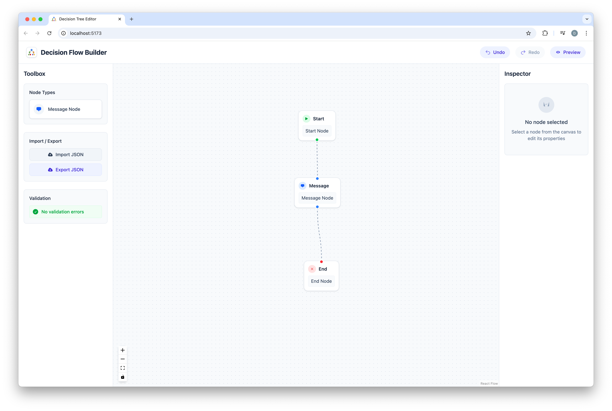

# Decision Tree Builder: Because Your Chatbot Needs Therapy Too

So you want to build a chatbot? How original. Welcome to "Decision Tree Builder" - the app where you can pretend to be a tech genius while just connecting boxes with lines.

_Decision Tree Builder in action - [Try it live here](https://davidyen1124.github.io/decision-tree/)_

## What Is This Thing?

This is a glorified flowchart maker disguised as "AI technology." We've wrapped ReactFlow in enough buzzwords to make it sound like you're building Skynet, when really you're just deciding whether your chatbot should say "How may I help you?" or "What can I do for you today?" - truly groundbreaking stuff.

## Features

- **Start and End Nodes**: Because apparently some people need to be told where to begin and end things.
- **Message Nodes**: Add text your users will inevitably skip over anyway.
- **Validation Errors**: Helpful messages like "Multiple Start nodes detected" - in case you thought chatbots could start existential crises by having multiple beginnings.
- **Undo/Redo**: For when you realize your entire decision tree is as logical as a cat chasing its tail.
- **Preview Mode**: See your chatbot in action before unleashing its mediocrity on the world.
- **Export/Import JSON**: So you can share your masterpiece with other people who will pretend to be impressed.

## Behind the Scenes: My Learning Journey

Let's be real - this is just a simple system I built while learning about decision trees. Some nerdy implementation details:

- Built an adjacency map for validating flows (because all the cool kids use graph theory)
- Used DFS (Depth-First Search) to check for cycles and unreachable nodes, like we're back in CS101
- Created a React context for nodes and edges, because passing props is so 2018
- Leveraged ReactFlow for the visual stuff, because drawing boxes manually would be too much work
- Implemented a Git-inspired staging/commit model for history - because who doesn't want to pretend they're using Git while using Git?

## What Could Possibly Go Wrong?

- Cycles in your flow (just like the circular logic in your product meetings)
- Unreachable nodes (like your career goals)
- Multiple start nodes (identity crisis)
- No path to end node (eternal customer support hell)

## Future "Improvements" (That I'll Probably Never Implement)

- Using proper diffing for history tracking (because right now it's about as efficient as storing the entire Amazon catalog for each change)
- Better preview mode with actual conversation flow (instead of the static mockup pretending to be interactive)
- Support for more node types beyond the basic three (the chatbot equivalent of learning more than "hello, goodbye, and where's the bathroom" in a foreign language)

Built with React + TypeScript + Vite, because using just one technology would be too simple. Happy tree building, and may your chatbot be slightly less annoying than the others!
